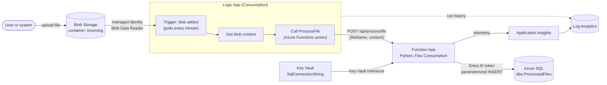

<!-- markdownlint-disable MD013 -->

# azure-logicapp-function-integration

Focus: event-driven workflows.
Goal: automate a data flow with a Logic App and an Azure Function.

**Use case:** a file is uploaded to Blob Storage. A Logic App sees the new blob,
reads it, and calls an Azure Function over HTTP. The function validates the data
and writes a row to **Azure SQL** (an earlier draft of this README said Cosmos DB;
the code has always used Azure SQL).

## Architecture



## Projects in this repo

| Folder | What it shows | Main tools | Status |
| --- | --- | --- | --- |
| [`SqlFunctionDemo/`](SqlFunctionDemo/README.md) | Python Azure Function (v2 model): input validation, parameterized SQL, passwordless SQL auth, safe error handling, pytest unit tests with a mocked database | Python, Azure Functions, pyodbc, azure-identity, pytest | Validated locally (unit tests) |
| [`infra/`](infra/README.md) | Bicep for the whole stack: Storage, Flex Consumption Function App, App Insights + Log Analytics, Key Vault, Logic App, least-privilege managed identity roles | Bicep, Azure CLI | Static checks only |
| [`sql/`](sql/schema.sql) | Table definition and least-privilege grants for the function's managed identity | T-SQL | Not tested |
| [`.github/workflows/ci-cd.yml`](.github/workflows/ci-cd.yml) | CI: pytest + Bicep build/lint. Manual CD: OIDC login, two-phase infra deploy, Flex Consumption code deploy | GitHub Actions | Static checks only |
| [Manual setup](#manual-setup-with-azure-cli) (below) | The original step-by-step Azure CLI walkthrough | Azure CLI | Not tested |

## Prerequisites

- Python 3.11 or 3.12 (to run the tests)
- Azure CLI 2.60+ with Bicep (`az bicep install`)
- Azure Functions Core Tools v4 (only to run or publish the function by hand)
- An Azure subscription and an Azure SQL database (only to deploy)

## How to use

Run the unit tests:

```bash
cd SqlFunctionDemo
python3 -m venv .venv && source .venv/bin/activate
pip install -r requirements-dev.txt
python -m pytest
```

Check the Bicep:

```bash
az bicep build --file infra/main.bicep --stdout > /dev/null
az bicep lint --file infra/main.bicep
```

Deploy (needs a subscription): follow [infra/README.md](infra/README.md), or run the
`ci-cd` workflow by hand with **deploy = true**.

## Repo layout

```text
.
├── .github/workflows/ci-cd.yml   # CI (tests, Bicep) and manual CD
├── SqlFunctionDemo/              # Azure Function app (Python v2 model)
│   ├── function_app.py           # HTTP trigger ProcessFile
│   ├── db.py                     # SQL connection + parameterized INSERT
│   ├── host.json
│   ├── requirements.txt / requirements-dev.txt
│   ├── local.settings.json.example
│   └── tests/                    # pytest, database mocked
├── infra/                        # Bicep
│   ├── main.bicep
│   ├── main.parameters.example.json
│   └── modules/                  # monitoring, storage, keyvault, functionapp, logicapp, rbac
└── sql/schema.sql                # table + grants for the managed identity
```

## CI/CD setup (GitHub Actions)

The `test` and `bicep` jobs run on every push and pull request. They need no secrets.
The `deploy` job runs only when you start the workflow by hand with **deploy = true**.

What the owner must add before the deploy job works:

1. An Entra app registration (or user-assigned identity) with a **federated credential** for this repo
   and the `dev` environment.
2. Give it **Contributor** and **Role Based Access Control Administrator** (or Owner) on the resource group.
   The template creates role assignments.
3. GitHub **secrets**: `AZURE_CLIENT_ID`, `AZURE_TENANT_ID`, `AZURE_SUBSCRIPTION_ID`.
4. GitHub **variables**: `AZURE_RESOURCE_GROUP`, `BASE_NAME`, `SQL_SERVER_NAME`, `SQL_DATABASE_NAME`.
5. A GitHub environment named `dev` (add required reviewers if you want an approval gate).
6. Run `sql/schema.sql` once against the database after the first deploy.

## Manual setup with Azure CLI

This is the original walkthrough, corrected. The Bicep in `infra/` does the same
thing in a safer way, so prefer it. Values in `<...>` are placeholders.

Steps:

1. Create Storage Account + Blob container
2. Create Function App (Python)
3. Create Application Insights
4. Create SQL server + database
5. Configure the Function App to connect to SQL
6. Create the table
7. Upload the function code
8. Create Logic App (Consumption) with a blob trigger and a function call
9. Test and verify

```bash
RG=test-rg
LOCATION=centralindia
STORAGE=<storage-account-name>     # 3-24 lowercase letters/numbers, globally unique
FUNC_APP=mypythonfunctiondemo
SQL_SERVER=sqlfunctionserverdemo
SQL_DB=functiondb
```

### Create Storage Account + Blob container

Storage is used for blob uploads and as the Function App's backing storage.

```bash
az storage account create \
  -g "$RG" \
  -n "$STORAGE" \
  -l "$LOCATION" \
  --sku Standard_LRS \
  --min-tls-version TLS1_2 \
  --allow-blob-public-access false

# Create the "incoming" container with your Entra ID login (no account key needed).
# You need the "Storage Blob Data Contributor" role on the account.
az storage container create \
  --name incoming \
  --account-name "$STORAGE" \
  --auth-mode login
```

This container triggers the Logic App.

### Create Azure Function App (Python)

Use the Flex Consumption plan. The older Linux Consumption plan
(`--consumption-plan-location`) is legacy, and Python 3.10 reaches end of life in October 2026.

```bash
az functionapp create \
  --resource-group "$RG" \
  --name "$FUNC_APP" \
  --storage-account "$STORAGE" \
  --flexconsumption-location "$LOCATION" \
  --runtime python \
  --runtime-version 3.12 \
  --assign-identity '[system]'
```

### Create Application Insights and link it to the Function App

```bash
az monitor app-insights component create \
  --app mypythonfunctionappinsights \
  --location "$LOCATION" \
  --resource-group "$RG" \
  --kind web \
  --application-type web

AI_CONN=$(az monitor app-insights component show \
  --app mypythonfunctionappinsights \
  --resource-group "$RG" \
  --query connectionString -o tsv)

az functionapp config appsettings set \
  --name "$FUNC_APP" \
  --resource-group "$RG" \
  --settings APPLICATIONINSIGHTS_CONNECTION_STRING="$AI_CONN"
```

Only `APPLICATIONINSIGHTS_CONNECTION_STRING` is needed. The old
`APPINSIGHTS_INSTRUMENTATIONKEY` setting is deprecated. Do not paste real keys or
connection strings into a README.

### Create SQL server + database

Use Microsoft Entra-only authentication, so there is no SQL admin password at all.

```bash
ME=$(az ad signed-in-user show --query "{name:userPrincipalName, id:id}" -o tsv)
read -r ADMIN_NAME ADMIN_ID <<< "$ME"

az sql server create \
  --name "$SQL_SERVER" \
  --resource-group "$RG" \
  --location "$LOCATION" \
  --enable-ad-only-auth \
  --external-admin-principal-type User \
  --external-admin-name "$ADMIN_NAME" \
  --external-admin-sid "$ADMIN_ID"

az sql db create \
  --resource-group "$RG" \
  --server "$SQL_SERVER" \
  --name "$SQL_DB" \
  --service-objective Basic
```

The Function App runs inside Azure, so it needs a firewall rule. `0.0.0.0` means
"allow Azure services". Note that this allows any Azure service, also from other
tenants. For production, use a private endpoint and VNet integration instead.

```bash
az sql server firewall-rule create \
  -g "$RG" \
  -s "$SQL_SERVER" \
  -n AllowAzureServices \
  --start-ip-address 0.0.0.0 \
  --end-ip-address 0.0.0.0
```

### Configure the Function App to connect to SQL

`pyodbc` needs an **ODBC** connection string with a `Driver=` part. The ADO.NET
format used in the first version of this README
(`Authentication="Active Directory Default"`) does not work with `pyodbc`.
The function gets an Entra ID token from its managed identity, so the string has no password.

```bash
az functionapp config appsettings set \
  --name "$FUNC_APP" \
  --resource-group "$RG" \
  --settings \
    SQL_CONNECTION_STRING="Driver={ODBC Driver 18 for SQL Server};Server=tcp:$SQL_SERVER.database.windows.net,1433;Database=$SQL_DB;Encrypt=yes;TrustServerCertificate=no;Connection Timeout=30;" \
    SQL_USE_MANAGED_IDENTITY=true
```

In `infra/` this value lives in Key Vault and the app setting is a Key Vault reference.

### Create the table and the database user

Before the function can insert data, create the table and a database user for the
function's managed identity. Run [`sql/schema.sql`](sql/schema.sql) in the Azure portal
Query editor, SSMS, or Azure Data Studio (replace `<function-app-name>` with `$FUNC_APP`).
It creates:

```sql
CREATE TABLE dbo.ProcessedFiles (
    Id            INT IDENTITY(1,1) PRIMARY KEY,
    FileName      NVARCHAR(255) NOT NULL,
    ProcessedTime DATETIME2(3)  NOT NULL DEFAULT SYSUTCDATETIME(),
    Status        NVARCHAR(50)  NOT NULL,
    Content       NVARCHAR(MAX) NULL
);
```

### Function App code

```text
SqlFunctionDemo/
├── function_app.py               <-- HTTP trigger ProcessFile
├── db.py                         <-- SQL access
├── host.json
├── local.settings.json.example   <-- copy to local.settings.json (git-ignored)
├── requirements.txt
└── tests/
```

The project was created with:

```bash
func init SqlFunctionDemo --python
cd SqlFunctionDemo
func new --name ProcessFile --template "HTTP trigger"
```

Publish it:

```bash
cd SqlFunctionDemo
func azure functionapp publish "$FUNC_APP" --python
```

### Useful lookups

```bash
az sql server list --resource-group "$RG" --query "[].{name:name, fqdn:fullyQualifiedDomainName}"
az sql db list --resource-group "$RG" --server "$SQL_SERVER" --query "[].name"
az sql server ad-admin list --resource-group "$RG" --server-name "$SQL_SERVER"
```

### Create the Logic App

In the portal: create a Logic App (Consumption), add the trigger **When a blob is added or
modified (properties only) (V2)** on the `incoming` container, then **Get blob content (V2)**,
then **Azure Functions > ProcessFile** with this body:

```json
{
  "fileName": "@{triggerBody()?['Name']}",
  "content": "@{body('Get_blob_content')}"
}
```

The Bicep version of this workflow is in [`infra/modules/logicapp.bicep`](infra/modules/logicapp.bicep).

### Test and verify

Upload a file to `incoming`, wait about one minute, then check the Logic App run
history and the table:

```sql
SELECT TOP 10 * FROM dbo.ProcessedFiles ORDER BY Id DESC;
```

## Tested

What was run (offline, no Azure login):

| Check | Command | Result |
| --- | --- | --- |
| Unit tests | `python -m pytest` (Python 3.10 venv) | 24 passed |
| Python syntax | `python -m py_compile function_app.py db.py` | OK |
| Bicep build | `bicep build infra/main.bicep` (Bicep CLI 0.47.16) | Success, 0 warnings |
| Bicep lint | `bicep lint infra/main.bicep` and each module | 0 errors, 0 warnings (2 type-definition warnings suppressed on purpose, see infra/README.md) |
| Workflow syntax | `actionlint` 1.7.7 with shellcheck | No findings |
| Bicep formatting | `bicep format` + `diff` on every file | No changes |
| Mermaid diagrams | Mermaid parser on all README files | valid |
| Markdown | `markdownlint-cli2`, `cspell` | clean |

Not tested:

- No deployment to Azure. That needs a subscription, and `az login` was not used.
- No real SQL connection (needs Azure SQL and the ODBC driver).
- The Logic App workflow definition and the GitHub Actions deploy job have not run.
- The manual CLI walkthrough was not re-run after the corrections.

## Skills demonstrated

- Event-driven integration with Logic Apps (Consumption) and Azure Functions
- Python Azure Functions (v2 programming model) with clean input validation and error handling
- SQL injection prevention with parameterized queries
- Passwordless access: managed identities for Storage, Key Vault, Application Insights, and Azure SQL
- Key Vault references for app settings
- Least-privilege RBAC scoped to a single secret and a single container
- Infrastructure as Code with modular Bicep (Flex Consumption plan)
- Unit testing with pytest and mocks
- CI/CD with GitHub Actions and OIDC (no stored cloud credentials)

TODO (Siva): add a screenshot of a successful Logic App run or a short note on where you used this pattern at work.
