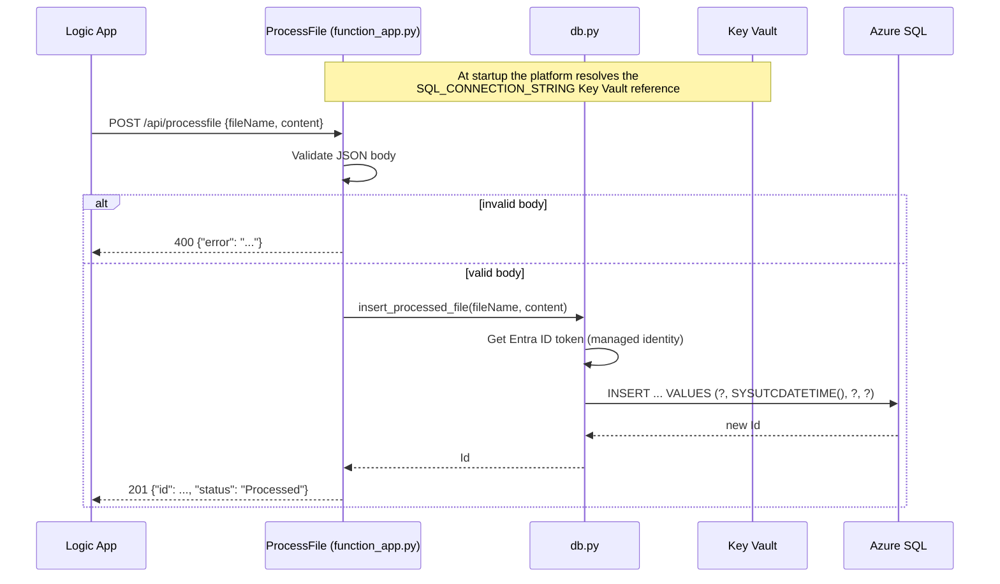

<!-- markdownlint-disable MD013 -->

# SqlFunctionDemo – ProcessFile function

## Goal

A small Python Azure Function (v2 programming model) with one HTTP endpoint.
The Logic App sends it a file name and the file text. The function checks the
input and writes one row to the `dbo.ProcessedFiles` table in Azure SQL.

## Flow



## Prerequisites

- Python 3.11 or 3.12
- [Azure Functions Core Tools v4](https://learn.microsoft.com/azure/azure-functions/functions-run-local)
  (only to run the function locally)
- [Microsoft ODBC Driver 18 for SQL Server](https://learn.microsoft.com/sql/connect/odbc/linux-mac/installing-the-microsoft-odbc-driver-for-sql-server)
  (only to connect to a real database; the unit tests do not need it)
- An Azure SQL database with the table from [`../sql/schema.sql`](../sql/schema.sql)

## Files

| File | Purpose |
| --- | --- |
| `function_app.py` | HTTP trigger `ProcessFile` (route `processfile`, `POST`, function key auth). Input validation and error handling. |
| `db.py` | Opens the SQL connection (connection string or managed identity token) and runs the parameterized `INSERT`. |
| `host.json` | Functions host settings and extension bundle `[4.*, 5.0.0)`. |
| `requirements.txt` | Runtime packages: `azure-functions`, `azure-identity`, `pyodbc`. |
| `requirements-dev.txt` | Runtime packages plus `pytest`. |
| `local.settings.json.example` | Copy to `local.settings.json` for local runs. The real file is git-ignored. |
| `tests/` | pytest unit tests. The database layer is mocked. |
| `.funcignore` | Keeps tests, venv, and local settings out of the deployment package. |

## App settings

| Setting | Example | Notes |
| --- | --- | --- |
| `SQL_CONNECTION_STRING` | `@Microsoft.KeyVault(SecretUri=https://kv-.../secrets/SqlConnectionString)` | ODBC format (`Driver={ODBC Driver 18 for SQL Server};Server=...`). In Azure it is always a Key Vault reference. |
| `SQL_USE_MANAGED_IDENTITY` | `true` | `true`: get an Entra ID token with `DefaultAzureCredential` (managed identity in Azure, `az login` locally). The connection string must not contain `UID`, `PWD`, or `Authentication=`. `false`: use the connection string as it is. |

## Usage

Run the unit tests (no Azure and no ODBC driver needed):

```bash
cd SqlFunctionDemo
python3 -m venv .venv
source .venv/bin/activate
pip install -r requirements-dev.txt
python -m pytest
```

Run the function locally against a real database:

```bash
cp local.settings.json.example local.settings.json
# edit SQL_CONNECTION_STRING, then sign in so DefaultAzureCredential gets a token
az login
func start
```

Call it:

```bash
curl -i -X POST http://localhost:7071/api/processfile \
  -H "Content-Type: application/json" \
  -d '{"fileName": "orders.csv", "content": "id,qty\n1,5"}'
```

## How to verify

- A good request returns `201` and a JSON body with the new `id`.
- `SELECT TOP 5 * FROM dbo.ProcessedFiles ORDER BY Id DESC;` shows the row.
- A bad request (missing `fileName`, not JSON) returns `400` and writes nothing.
- In Azure, open Application Insights > Transaction search to see each call and any exception.

## Clean up

```bash
deactivate
rm -rf .venv .pytest_cache local.settings.json
```

## Troubleshooting

| Symptom | Likely cause and fix |
| --- | --- |
| `ImportError: libodbc.so.2` | unixODBC / ODBC Driver 18 is not installed. Install it, or only run the unit tests (they mock `pyodbc`). |
| `Data source name not found` | The connection string has no `Driver={ODBC Driver 18 for SQL Server};`. ADO.NET strings (the old README format) do not work with `pyodbc`. |
| `Login failed for user '<token-identified principal>'` | The managed identity has no database user. Run step 2 and 3 of `sql/schema.sql`. |
| `500 {"error": "Service is not configured"}` | `SQL_CONNECTION_STRING` is empty. In Azure, check that the Key Vault reference shows a green check in the portal (the identity needs **Key Vault Secrets User**). |
| `401` from Azure | The function uses `AuthLevel.FUNCTION`. Send the key in `x-functions-key` or `?code=`. The Logic App adds it for you. |

## Tested

- `python -m pytest` in a Python 3.10 virtual environment: **24 passed**. Tests cover valid input,
  12 invalid payloads, oversized content, SQL-injection text passed as data, generic 500 responses
  that do not leak exception text, connection-string auth, managed identity token packing, commit,
  rollback, and closing of the connection.
- **Not tested:** a real Azure SQL connection, `func start`, and the deployed function. These need
  an Azure subscription and the ODBC driver.

## Interview talking points

- **Parameterized query, not string building.** Values go to `cursor.execute` as parameters, so text
  like `'); DROP TABLE` is stored as data. A unit test proves it.
- **Passwordless SQL.** The function gets an Entra ID token from its managed identity and passes it to
  the ODBC driver (`SQL_COPT_SS_ACCESS_TOKEN`). The Key Vault secret holds only the server and database
  names, so there is no password to rotate.
- **Safe errors.** Bad input gets `400` with a clear message. Server errors get a generic `500`; the full
  stack trace goes only to Application Insights.
- **Testable design.** The handler and the database code are in separate modules, and `pyodbc` is
  imported lazily, so tests run anywhere without the native driver.
- **Trade-off:** the function opens one connection per request. That is fine for a few files per
  minute. For high volume I would add connection reuse or move to a queue-based batch insert.
