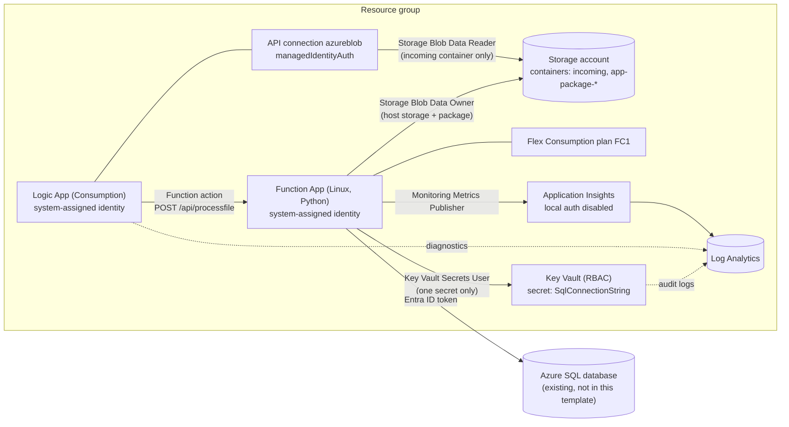

<!-- markdownlint-disable MD013 -->

# infra – Bicep for the Logic App + Function integration

## Goal

Deploy every Azure resource the integration needs with one Bicep template.
No keys or passwords are stored in the template, in app settings, or in the
Logic App. Each service uses its own system-assigned managed identity with
the smallest role it needs.

## Architecture



## What gets deployed

| Module | Resources | Key settings |
| --- | --- | --- |
| `modules/monitoring.bicep` | Log Analytics workspace, Application Insights | Workspace-based App Insights, `DisableLocalAuth: true` (Entra ID telemetry only). |
| `modules/storage.bicep` | Storage account, `incoming` and `app-package-*` containers | TLS 1.2, no public blob access, **shared key access disabled**. |
| `modules/keyvault.bicep` | Key Vault, secret `SqlConnectionString`, diagnostic setting | RBAC mode, soft delete 90 days, optional purge protection, audit logs to Log Analytics. |
| `modules/functionapp.bicep` | Flex Consumption plan (`FC1`), Linux Function App | Python 3.12, identity-based `AzureWebJobsStorage`, Key Vault reference for `SQL_CONNECTION_STRING`, HTTPS only, FTP/SCM basic auth off. |
| `modules/logicapp.bicep` | `azureblob` API connection, Logic App workflow, diagnostic setting | Blob trigger with managed identity, built-in Azure Functions action, retry policy. |
| `modules/rbac.bicep` | Role assignments | See the table below. |

### Why Flex Consumption

Flex Consumption is the serverless plan Microsoft recommends for new Linux
function apps. The older Linux Consumption (`Y1`) plan is legacy and gets no new
features. Flex adds per-function scaling, managed identity for the deployment
package, and VNet integration. Check that your region supports it:

```bash
az functionapp list-flexconsumption-locations --output table
```

### Role assignments (least privilege)

| Identity | Role | Scope | Why |
| --- | --- | --- | --- |
| Function App | Storage Blob Data Owner | Storage account | Functions host storage (locks, keys) and the Flex deployment package. This is the role Microsoft documents for identity-based `AzureWebJobsStorage`. |
| Function App | Key Vault Secrets User | **The one secret** | Resolve the `SQL_CONNECTION_STRING` Key Vault reference. It cannot read other secrets. |
| Function App | Monitoring Metrics Publisher | Application Insights | Send telemetry with Entra ID auth. |
| Logic App | Storage Blob Data Reader | **`incoming` container** | List and read new blobs. It cannot write or see other containers. |
| Function App | `INSERT` + `SELECT (Id)` on `dbo.ProcessedFiles` | SQL database | Done in T-SQL with `sql/schema.sql`, not in Bicep. |

## Prerequisites

- Azure CLI 2.60 or later with Bicep (`az bicep install`)
- A resource group, and rights to create role assignments in it
  (Owner, or Contributor + Role Based Access Control Administrator)
- An existing Azure SQL server and database with a Microsoft Entra admin
  (the template does not create SQL)

## Files

| File | Purpose |
| --- | --- |
| `main.bicep` | Entry point. Builds resource names and wires the modules together. |
| `modules/*.bicep` | One module per concern (see above). |
| `main.parameters.example.json` | Example parameter values. Copy it and edit. |

## Usage

1. Set variables and create the resource group.

   ```bash
   RG=rg-lafunc-dev
   LOCATION=centralindia
   az group create --name "$RG" --location "$LOCATION"
   cp infra/main.parameters.example.json infra/dev.parameters.local.json
   # edit sqlServerName and sqlDatabaseName (*.parameters.local.json is git-ignored)
   ```

2. Preview, then deploy **without** the Logic App. The workflow's Function action
   points to `ProcessFile`, which only exists after the code is published.

   ```bash
   az deployment group what-if --resource-group "$RG" \
     --template-file infra/main.bicep \
     --parameters @infra/dev.parameters.local.json deployLogicApp=false

   az deployment group create --resource-group "$RG" \
     --template-file infra/main.bicep \
     --parameters @infra/dev.parameters.local.json deployLogicApp=false \
     --query properties.outputs
   ```

3. Give the function's identity access to the database. Connect as the
   Entra admin and run [`../sql/schema.sql`](../sql/schema.sql) with
   `<function-app-name>` replaced by the `functionAppName` output.

4. Publish the function code.

   ```bash
   cd SqlFunctionDemo
   func azure functionapp publish <functionAppName> --python
   cd ..
   ```

5. Deploy again, now with the Logic App.

   ```bash
   az deployment group create --resource-group "$RG" \
     --template-file infra/main.bicep \
     --parameters @infra/dev.parameters.local.json deployLogicApp=true
   ```

The GitHub Actions workflow in `.github/workflows/ci-cd.yml` runs the same three
steps (phase 1, code, phase 2).

### Using SQL authentication instead

Pass a full ODBC connection string as the secure parameter
`sqlConnectionString`. It is stored only in Key Vault, and the template sets
`SQL_USE_MANAGED_IDENTITY=false`. Do not put it in a parameters file in git.

```bash
read -rs SQL_CONN   # paste the connection string, it is not echoed
az deployment group create --resource-group "$RG" \
  --template-file infra/main.bicep \
  --parameters @infra/dev.parameters.local.json sqlConnectionString="$SQL_CONN"
```

## How to verify

```bash
# Key Vault reference resolved? (status should be "Resolved")
az rest --method get --url \
  "https://management.azure.com$(az functionapp show -g "$RG" -n <functionAppName> --query id -o tsv)/config/configreferences/appsettings?api-version=2023-12-01" \
  --query "value[?name=='SQL_CONNECTION_STRING'].properties.status"

# Upload a test file with your own Entra identity (shared keys are disabled).
# You need Storage Blob Data Contributor on the container for this.
echo "id,qty" > test.csv
az storage blob upload --auth-mode login --account-name <storageAccountName> \
  --container-name incoming --name test.csv --file test.csv

# After about one minute, check the Logic App runs
az rest --method get --url \
  "https://management.azure.com$(az resource show -g "$RG" -n <logicAppName> --resource-type Microsoft.Logic/workflows --query id -o tsv)/runs?api-version=2019-05-01" \
  --query "value[0].properties.status"
```

Then check the new row in `dbo.ProcessedFiles`.

## Clean up

```bash
az group delete --name "$RG" --yes --no-wait
# Key Vault stays soft-deleted. If purge protection is off you can purge it:
az keyvault purge --name <keyVaultName>
```

## Troubleshooting

| Symptom | Likely cause and fix |
| --- | --- |
| `LocationNotAvailableForResourceType` for `FlexConsumption` | Region has no Flex Consumption. Pick one from `az functionapp list-flexconsumption-locations`. |
| Logic App deployment fails with "function not found" | Code is not published yet. Deploy with `deployLogicApp=false`, publish, then deploy with `true`. |
| Logic App trigger fails with `403 AuthorizationPermissionMismatch` | Role assignment is still propagating (can take a few minutes) or the connection is not using `managedIdentityAuth`. |
| Key Vault reference shows an error in the portal | The Function App identity has no **Key Vault Secrets User** on the secret yet. Wait a few minutes, then restart the app. |
| `RoleAssignmentExists` on redeploy | A role assignment for the same identity was created by hand. Delete the manual one; the template uses stable `guid()` names. |
| `az storage ... KeyBasedAuthenticationNotPermitted` | Shared keys are disabled on purpose. Use `--auth-mode login`. |

## Tested

- `bicep build infra/main.bicep` with Bicep CLI 0.47.16: success, 0 warnings.
- `bicep lint` on `main.bicep` and every module: 0 errors, 0 warnings.
  Two warnings are suppressed with `#disable-next-line` in `logicapp.bicep`, because the Bicep type
  definitions for `Microsoft.Web/connections` do not include `kind` (BCP187) or `parameterValueSet` (BCP089).
  Both are used by the Microsoft docs for managed identity API connections.
- `bicep format` gives no changes. Both example JSON files parse.
- The compiled ARM JSON was checked by hand: the Logic App expressions (`@{...}`) are kept as literal text.
- **Not tested:** no deployment to Azure (no subscription or `az login` was used). These
  parts are written from the Microsoft docs and are the most likely to need a fix on the first real
  deploy: the blob connector paths in the Logic App definition (`/v2/datasets/.../triggers/batch/onupdatedfile`),
  the `managedIdentityAuth` connection, and the built-in Function action against a Flex Consumption app.
  Open the workflow in the Logic App designer after the first deploy to confirm.

## Interview talking points

- **No secrets anywhere.** Storage shared keys are disabled, App Insights local auth is disabled, and SQL
  uses an Entra ID token. The Key Vault secret holds only server and database names, but the Key Vault
  reference pattern stays in place if SQL auth is ever needed.
- **Scope roles to the smallest resource.** The function can read one secret, not the vault. The Logic App
  can read one container, not the account. Role assignment names use `guid()` so redeploys are idempotent.
- **Two-phase deploy.** The Logic App's Function action needs the function to exist, so the pipeline deploys
  infra, then code, then the workflow. The alternative (HTTP action with a function key from `listKeys`) works
  in one pass but puts a key in the workflow.
- **Polling trigger trade-off.** The blob trigger polls every minute and costs one action per check. For high
  volume or lower latency, Event Grid (blob created) to the Logic App or straight to the function is better.
- **Retries and idempotency.** The Function action retries 3 times. A retry after a timeout could insert a
  duplicate row; a unique key on file name + ETag would make inserts idempotent.
